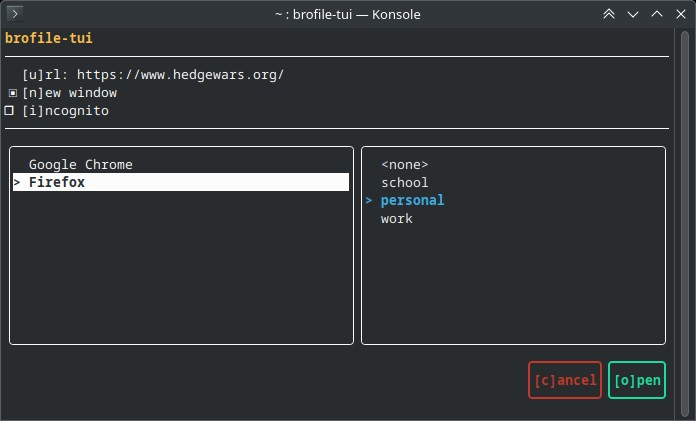

# brofile
brofile is a tool which grants you the power of choosing the browser profile, which you want to use opening a url.



# Why to use?
Isn't it annoying that the browser decides by itself, which profile to use when you open a link from an external app? In Chrome it's the last active profile, in Firefox it's the default one. What a mess! Finally, you are able to bring peace to your "following links" routine!

# Installation
Currently there are no pre-built packages. It's version 0.0.0-rc0, come on! You will need to build it yourself.

Steps:
```bash
git clone https://github.com/llem00n/brofile
cd brofile
mkdir build && cd build
cmake --build .
sudo cmake --install . --prefix /usr
```

# Usage
First things first, you need to set the tool as the default browser. In order to do that, run:
```bash
xdg-settings set default-web-browser brofile-tui.desktop
```

Now, you can proceed with opening links in a non-browser app. Congratulations, you now have more power over your browser than before!